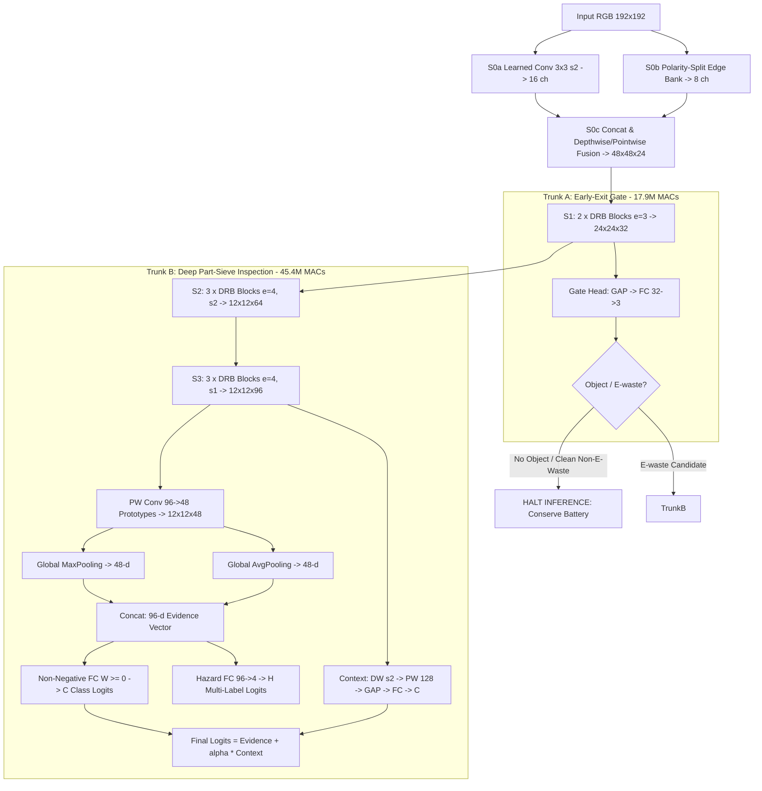

# SIEVE-Net: Architecture & Quantization Co-Design Specification

**Model Family:** SIEVE (Staged Inference for E-waste Verification at the Edge)  
**Target Hardware:** Ultra-Low-Tier Mobile CPU (2GB RAM, Android 8+ / API 26)  
**Runtime:** Google LiteRT (Full-Integer INT8 with XNNPACK)  
**Author:** Kapish Mittal  

---

## 1. High-Level Architectural Pipeline

---

## 2. Core Innovations

### 2.1 Polarity-Split Fixed Edge Bank (S0b)
Standard networks spend early layer capacity learning primitive oriented edge detectors from scratch. In S0b, we construct a fixed, non-trainable 8-channel convolution bank:
- 4 Orientations: $0^\circ, 45^\circ, 90^\circ, 135^\circ$
- 2 Polarities: Positive gradient and negative gradient
Because activations pass through $\text{ReLU6}$, standard edge filters discard negative excursions. By splitting polarities into paired channels ($+e$ and $-e$), both gradient directions are preserved natively before fusion.

### 2.2 Dual-Rate Inverted Bottleneck (DRB)
The Dual-Rate Block expands input features by an expansion ratio $e \in \{3, 4\}$.
- At `stride == 1`: Two parallel depthwise convolutions are computed:
  $$h = \text{ReLU6}\left(\text{DW}_{3\times3}^{d=1}(x_{\text{exp}}) + \text{DW}_{3\times3}^{d=2}(x_{\text{exp}})\right)$$
  capturing both local micro-textures (traces, solder points) and broader component contours (battery pouches, connector bodies).
- At `stride == 2`: A single-rate depthwise convolution is used, guaranteeing that LiteRT INT8 graph converters never encounter unsupported strided dilation kernels.
- Linear Bottleneck: The final $1 \times 1$ pointwise projection has no activation, preventing information collapse in low-dimensional manifold spaces.

### 2.3 Part-Sieve Explainability Head
E-waste is inherently recognizable by its micro-parts rather than global shapes. 
1. **48 Prototype Maps ($12 \times 12 \times 48$):** The first 12 channels correspond to supervised named parts (`circuit_board`, `battery_cell`, `charging_port`, etc.), while the remaining 36 channels discover unsupervised geometric motifs.
2. **Dual Pooling Evidence:**
   $$E = [\text{GlobalMax}(M) \parallel \text{GlobalAvg}(M)] \in \mathbb{R}^{96}$$
   - GlobalMax reflects part presence anywhere in the frame.
   - GlobalAvg reflects relative spatial extent.
3. **Non-Negative Readout Matrix:**
   Class evidence weights $\mathbf{W}$ are constrained strictly non-negative ($\mathbf{W} \ge 0$). Parts can only add evidence for an e-waste class, preventing uninterpretable cancellations and enabling direct visual heatmap attribution on low-cost viewfinders.
4. **Context Branch & Context Dropout:**
   To prevent the network from relying entirely on global context, context-dropout ($p=0.3$) randomly zeros the context path during training, forcing the classifier to ground its predictions on verified physical components.

---

## 3. Quantization Co-Design & Memory Guarantees

| Metric | Target Limit | Measured SIEVE-S | Compliance Margin |
|---|---|---|---|
| **Parameters** | $\le 800,000$ | **330,229** | **58.7% under budget** |
| **INT8 Size** | $\le 1,200\text{ KB}$ | **322.5 KB** | **73.1% under budget** |
| **MACs (192²)** | $\le 120,000,000$ | **63,288,736** | **47.3% under budget** |
| **Trunk A MACs** | $\le 20,000,000$ | **17,892,960** | **~11.2ms CPU execution** |
| **Peak Activation** | $\le 200\text{ KB}$ | **162.0 KB** | **Strict fit in L2/L3 cache** |

All layers use $\text{ReLU6}$ for bounded activation ranges, eliminating clipping distortion during full-integer INT8 quantization.
